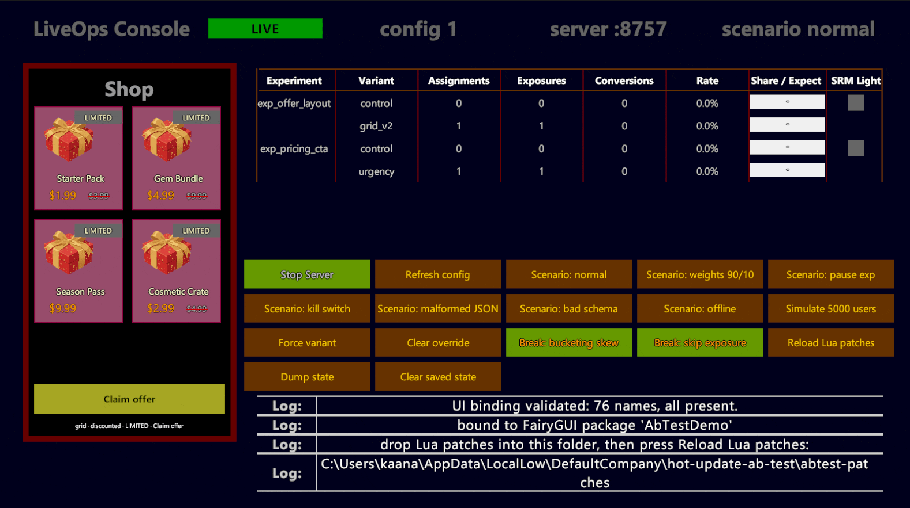

# hot-update-ab-test

**A LiveOps A/B testing framework for Unity.** Experiment configuration arrives from a server at runtime;
variant *behaviour* lives in hot-updatable Lua. The subject is the experiment infrastructure — deterministic
bucketing, layered mutual exclusion, exposure telemetry, kill switches and guardrails. Hot update is the
delivery mechanism, not the headline.


Suppressed exposure logging leaves the assignment split perfectly even while it destroys the data. The
alarm fires because SRM is measured over the exposed population; an assignment-based check would have
stayed green through exactly the failure it exists to catch.

Unity 6 · C# · xLua · FairyGUI · **396 distinct tests**: 238 engine-free core tests that run under
`dotnet test` in CI *and* again inside Unity, plus 116 Unity-only EditMode tests and 42 PlayMode tests.
The suites overlap, so those are not added together — see below.

---

## The two decisions this repository is really about

**Exposure is logged when the user sees the treated surface, not when a variant is assigned.** Assignment is
a pure function you may call speculatively — to warm a screen, to render a debug panel, to simulate a
population — and it logs nothing. Logging at assignment time would put users who never opened the shop into
both arms' denominators, diluting measured lift toward zero and destroying the sample-ratio check as a
diagnostic, because the ratio would then always match by construction.

**Sample-ratio mismatch is measured over the exposed population, not over assignments.** The demo ships a
button that makes one variant skip its exposure logging: under that fault the *assignment* split stays a
flawless 50/50 while half the data is silently destroyed. An assignment-based check sails straight through
it. The population an analysis draws conclusions from is the set of users who actually saw the treatment, so
that is the population whose ratio has to be tested — and a test asserts exactly this, feeding one run's
assignment counts to the same checker and showing it come back healthy while the exposure-based check
alarms.

---

## What it does

- **Deterministic bucketing.** MurmurHash3 x86_32 over UTF-8 bytes, pinned by SMHasher's own verification
  value. Stable across sessions, processes and platforms. Not `string.GetHashCode`, which is not a contract:
  Mono and IL2CPP disagree on it, engine upgrades can change it, and the seed is randomized per process.
- **Layers with structural mutual exclusion.** Running experiments claim disjoint bucket ranges, so at most
  one can contain a user's bucket *by construction* — there is no runtime decision left to get wrong.
  Per-layer salting keeps layers statistically independent; a negative-control test builds two layers that
  share a salt and asserts they come out perfectly confounded.
- **Two hashes, not one.** The layer salt picks the experiment, a separate experiment salt picks the arm, so
  ramping traffic and changing the variant split are knobs an operator can turn one at a time.
- **Sticky-after-exposure assignment.** Assignment is stateless and free until the user is exposed; that
  first exposure pins the arm. Nobody who has been treated ever switches arms, while users who have
  contributed nothing to the analysis are re-bucketed freely, so ramping still works.
- **A documented fallback ladder.** Live beats last-known-good beats shipped defaults beats nothing, and the
  rung in force is visible on screen. A rejected payload leaves no latch: the next good one is accepted.
- **Kill switch.** Setting an experiment to `paused` or `stopped` returns every user to control on the next
  refresh and discards their cached assignments.
- **Telemetry with guardrails.** Exposure deduplicated per session, conversion attributed from the exposure
  record rather than by re-resolving, forced and synthetic traffic flagged and filtered, contamination
  detected rather than swallowed, and a sample-ratio check with floors so it cannot cry wolf.
- **Hot-updatable variant behaviour.** A Lua patch dropped in a folder can change what a variant presents,
  or register a whole new variant, with no C# change and no rebuild. `examples/lua-patches/` holds five
  to try, across both layers, including two that are refused on purpose. Registering an arm and *running* one are separate,
  deliberately: the resolver picks variants from the config, so a patch cannot enrol anyone in an
  experiment nobody configured.

## See it

Five takes from the demo, each making one argument. `docs/DEMO_SCRIPT.md` is the shooting order, with the
still-frame tell for every beat.

### The kill switch



Setting an experiment to `stopped` returns every user to control on the next config refresh and discards
cached assignments. The chip states which source is in force, so the guardrail is visible rather than
merely present.

### The fallback ladder


A malformed payload is rejected whole. The last known good configuration stays in force, one line names the
rule that failed, and the screen does not change. Nothing here is meant to be dramatic — that is the point.

### Hot update, both directions


A Lua patch changes a running variant with no rebuild, and deleting the file puts it back. Both directions
in one take: for every state a patch can put the system into, there is a defined way out.

### A patch that is refused


A patch asking for a layout nobody drew is rejected whole rather than partially applied: the layout layer
falls back to control and the strip says why. Notice what did not change — the price presentation, the badge
and the CTA all keep their treatment, because they belong to a different layer that this patch never
touched. Closed vocabulary, whole-table rejection, and layer independence in six seconds.

## Run it

Open `Assets/Scenes/AbTestDemo.unity` and press play. Every control above is a button in the LiveOps panel,
and `examples/lua-patches/` holds five patches to drop into the running demo — including the two that are
refused on purpose, so the rejection paths can be reached by hand rather than taken on trust.

## Tests

```powershell
dotnet test dotnet/HotUpdateABTest.sln          # 238 core tests, ~15s, no Unity licence needed
```

The decision core is written without touching `UnityEngine` and is compiled a second time as a plain .NET
project, so bucketing, config validation and telemetry run in CI in about ten seconds. That is not only for
speed: the Core assembly sets `noEngineReferences`, and CI greps for a Unity `using` before it builds, so
"the decision core has no engine dependency" is a build constraint rather than a claim in a README.

Unity's own suites run locally with the Editor closed — commands in `docs/STATUS.md`.

Those 238 core tests are a strict subset of the 354 EditMode ones: the same source compiled twice, once as
a plain .NET project and once by Unity. So the suites overlap, and adding their totals would count the core
tests twice. **396 distinct tests** — 238 core, 116 EditMode-only, 42 PlayMode.

Verified by comparing **fully-qualified** test names — fixture plus method — across the three result files,
not by subtracting totals. Every one of the 238 core names appears in the EditMode results, and no name
appears in both EditMode and PlayMode. The fixture name has to be part of the comparison: four different
fixtures each declare a test called `NullArgumentsAreRejected`, so a check on bare method names both
undercounts and can match two unrelated tests to each other. The arithmetic is in `docs/STATUS.md`.

### What the tests did not cover, and how that was found

The first hand play-test of the finished demo found three rendering defects. **The suite was green through
all three**, and the reason is worth more than the badge.

The demo has two UI paths: the authored FairyGUI package, and a programmatic fallback that lets it run
headless. The suite asserted the two declare **the same child names** — and nothing asserted they **behave**
alike. That gap is invisible until it matters, because the fallback is deliberately simpler: it has no
gears, no `GProgressBar`, no groups. It could not reproduce any of the three defects, because it does not
contain the machinery any of them lived in.

The clearest of the three, as a worked example. The authored offer card positions its children with gears
set to `positionsInPercent`, which means a child ends up at *fraction × current parent size* at the moment
a layout page is applied. Those fractions were computed against the card's authored 335×96. The code applied
the grid page while the card was already resized to 163×190, so `txtName`'s fraction of **1.208 × 190 put it
at y=229.5 in a 190-tall card** — outside it. The top row's name and price rendered underneath the row
below; the bottom row's fell past the list's clip. On screen: names on the last row only, prices nowhere. In
the suite: nothing, because the fallback card has no gears to be in percent mode.

What changed is not more tests of the same kind. It is a fixture that runs **against the authored package
specifically** — `PlayTestRegressionTests` — asserting behaviour rather than vocabulary: that a card's
children land inside their own card in both layouts, that every row of the metrics table aligns its
columns, that the share caption survives a layout pass. Each of the three defects has a test that failed
before its fix. The boot-time binding validation catches missing *names*; these catch wrong *behaviour*,
which is the half that was missing.

Two of the three were then fixed twice, and the second fix is the one worth copying. The code learned to
apply a layout page before resizing, and the gears were taken out of percent mode; the caption writes were
sequenced so `GProgressBar` could not clobber them, and then the child was renamed from `title` to
`txtShare` so the bar never adopts it in the first place. Correct sequencing is a rule someone has to keep
obeying. Removing the mechanism means there is no longer an order to get wrong.

Two more of the same shape turned up in the following week, and they are worth naming because neither was
a missing test — both were an artefact that was accurate about something other than the question being
asked.

**A comment claimed something no test checked.** A log-once key carried the note *"a newly broken file is
never swallowed by an earlier one's line"*. The key was the file path, which cannot deliver that: edit one
file until it works and every failure after the first is suppressed. The comment had been true of an
intention and never of the code, and nothing was checking the difference.

**A dedupe key made a repeated action report nothing.** Reload a broken patch and the first press wrote an
error row; every press after it wrote only the summary, which said `1 failed — see the failures above` and
pointed at a row it had just declined to write. Three views of one event — a counter, a pointer and the
rows — disagreed, and each was individually defensible. The first explanation offered for it was a contrast
measurement, correct to two decimal places and answering a question nobody had asked; the header word on
the row said `Log:`, which no colour can cause. The test that would have caught it asserts what the
component *displays*, not what the logger was *called with*.

The general lesson, stated because it generalises past this repository: **a stand-in simpler than the thing
it stands in for cannot test the thing it stands in for**, and **a measurement is not a verification until
something checks it against the observation it claims to explain.** It is worth knowing which half of your
suite is which.

---

## Honest limits

Four, stated plainly, because a limit with its reasoning reads as judgement and the same limit found by a
reviewer reads as a hole.

**The Lua sandbox is a capability restriction, not a resource limit.** A patch cannot reach the filesystem,
process control, `require`, runtime compilation, the `debug` library, or xLua's `CS` bridge — that last
omission is the load-bearing one, since it would otherwise hand a patch the entire C# type system including
the analytics sink. But nothing stops a patch spinning in `while true do end` and hanging the frame. Lua has
no preemption, so bounding execution needs a debug hook with an instruction-count budget. That is real work
and it belongs before this ships to devices; it is out of scope for a demo whose only patch author is the
person running it.

**Chunks load in text mode only.** `load(source, name, "t", sandbox)` — the `"t"` refuses precompiled
bytecode. The Lua bytecode verifier is not hardened and crafted bytecode can subvert the VM outright, so a
channel that accepts source alone is a materially smaller attack surface than one that accepts both. It
costs nothing here because patches are authored as source anyway.

**The two file-backed stores have no dedicated tests.** `FileAssignmentStore` and `FileConfigCache` are
exercised indirectly — pins survive a restart, last-known-good survives an outage — but nothing tests them
directly against a corrupt file, a partial write, a read-only directory or a disk that fills mid-write. The
in-memory implementations behind the same interfaces are tested thoroughly, so the *policy* is covered and
the *persistence* is not. On a real client that gap is where a crash-on-launch lives; here the blast radius
is a demo losing its pins.

**One test reads the authoring source rather than the published package.** `AuthoredContrastTests` measures
the log severity colours out of `FGUIProject/**/*.xml`, deliberately: it is a rule about what may be
authored, it should fail when somebody picks a colour rather than at the next publish, and it must not go
quiet because a republish is pending. The cost is that it cannot see drift between the authoring source and
the published `.bytes`. Everything else that touches the package binds to the published bytes, and boot
validation checks every name against what actually loaded.

More, with reasoning, in `docs/STATUS.md` — including what the sample-ratio thresholds are and why, the
four FairyGUI binding hazards this package hit, and what is deliberately not built.

## Scope

A portfolio piece, not a product. There is no network anywhere: the "server" is a local `HttpListener` you
start from the demo and can tell to serve malformed JSON or go offline. The analytics sink is in memory. The
metrics panel is instrumentation and trust guardrails — counts, rates and a ratio check — and deliberately
not an analysis engine: no significance testing on the conversion metric, because rates computed over a
"simulate 5000 users" button are not evidence of anything and a panel implying otherwise would be the
weakest thing here.

Lua runs on desktop x64 only; the vendored xLua native plugin covers no other platform.

## Documents

| | |
| --- | --- |
| `docs/STATUS.md` | Engineering log: environment, assemblies, test counts per area, every decision with its reasoning, and what is deliberately absent |
| `docs/DEMO_SCRIPT.md` | Recording order, with the still-frame tell for each beat |
| `docs/PRESENTATION_SPEC.md` | What a Lua patch may ask the shop screen to present — the closed vocabulary |
| `docs/PACKAGE_SPEC.md` | The FairyGUI package as authored, and how the code binds to it |
| `examples/lua-patches/` | Five patches to drop into a running demo, and what each one proves |

## Licence and provenance

Author: Kaan Altay. xLua (Tencent, MIT) and FairyGUI (MIT) are vendored with provenance in
`Assets/XLua/VENDORED.md` and `Assets/FairyGUI/VENDORED.md`.
